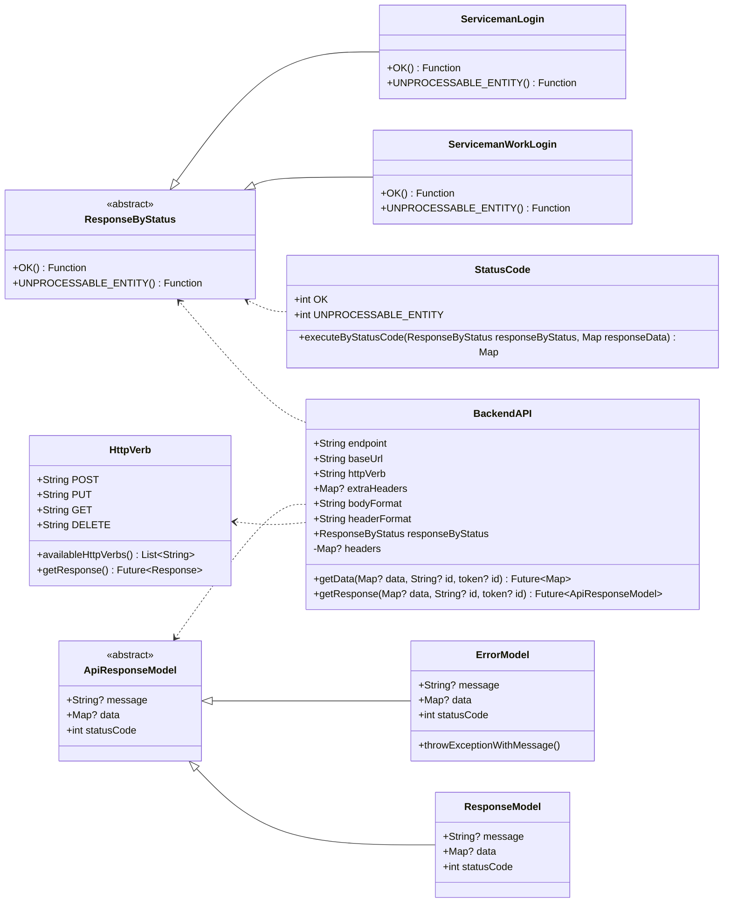

# api_connect

This package is used as an abstraction for all the APIs in the backend

```mermaid
classDiagram
    direction RL
    class ResponseByStatus {
        <<abstract>>
        +OK() Function 
        +UNPROCESSABLE_ENTITY() Function
    }
    BackendAPI ..>ResponseByStatus
    ServicemanLogin --|> ResponseByStatus
    ServicemanLogin : +OK() Function
    ServicemanLogin : +UNPROCESSABLE_ENTITY() Function
    ServicemanWorkLogin --|> ResponseByStatus
    ServicemanWorkLogin : +OK() Function
    ServicemanWorkLogin : +UNPROCESSABLE_ENTITY() Function
    class ApiResponseModel {
        <<abstract>>
        +String? message
        +Map? data
        +int statusCode
    }
    BackendAPI ..>ApiResponseModel
    ErrorModel --|> ApiResponseModel
    ResponseModel --|> ApiResponseModel
    class ErrorModel {
        +String? message
        +Map? data
        +int statusCode
        +throwExceptionWithMessage()
    }
    class ResponseModel {
        +String? message
        +Map? data
        +int statusCode
    }
    class HttpVerb{
        +String POST
        +String PUT
        +String GET
        +String DELETE
        +availableHttpVerbs() List~String~
        +getResponse() Future~Response~
    }
    class StatusCode {
        +int OK
        +int UNPROCESSABLE_ENTITY
        +executeByStatusCode(ResponseByStatus responseByStatus, Map responseData) Map
    }
    StatusCode ..> ResponseByStatus
    class BackendAPI {
        +String endpoint
        +String baseUrl
        +String httpVerb
        +Map? extraHeaders
        +String bodyFormat
        +String headerFormat
        +ResponseByStatus responseByStatus
        -Map? headers
        +getData(Map? data, String? id, token? id) Future~Map~
        +getResponse(Map? data, String? id, token? id) Future~ApiResponseModel~
    }
    
    BackendAPI ..> HttpVerb
```